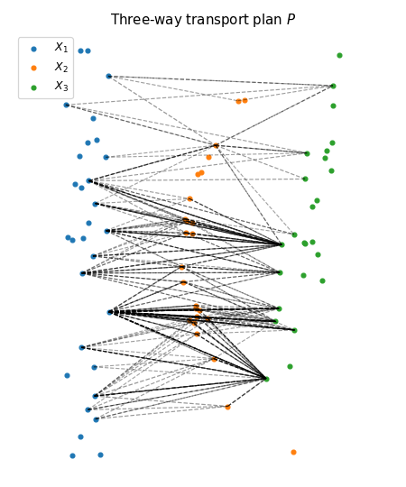

# Computational Optimal Transport

Work for the MVA course "Computational Optimal Transport' https://optimaltransport.github.io/

## Numerical tours

Install the toolbox [from here](http://www.numerical-tours.com/installation_python/).

## Final project: entropy approach for variational MFGs

